# 웹 빌리지 서비스 플로우

## 1. 메인페이지

### 1.1 로그인 후

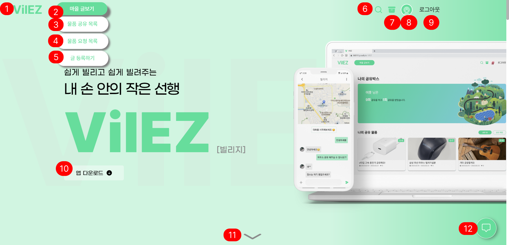

1. 메인 페이지로 이동
2. 마우스를 hover 하면 서비스의 메뉴가 열림
3. 물품 공유 목록으로 이동하는 버튼
4. 물품 요청 목록으로 이동하는 버튼
5. 물품 공유글이나 요청글을 등록하는 페이지로 이동하는 버튼
6. 물품 공유 목록으로 이동하는 버튼으로, 이동해서 원하는 물품을 찾음
7. 내가 공유한 물품과 내가 대여한 물품의 목록을 볼 수 있는 페이지로 이동하는 버튼
8. 마이프로필 페이지로 이동하는 버튼
9. 로그아웃을 하는 버튼
10. 빌리지 서비스의 앱을 다운로드할 수 있는 QR코드를 펼치는 버튼
11. 애니메이션이 적용되어 아래로 이동하는 버튼
12. 채팅 목록을 여는 플로팅 버튼으로, 실시간으로 들어오는 채팅 알림을 받을 수 있고, 새로운 채팅 알림이 오면 테두리에 빨간 점으로 알림을 준다. 로그인이 된 상태에서만 플로팅 알림을 볼 수 있음

### 1.2 로그인 전

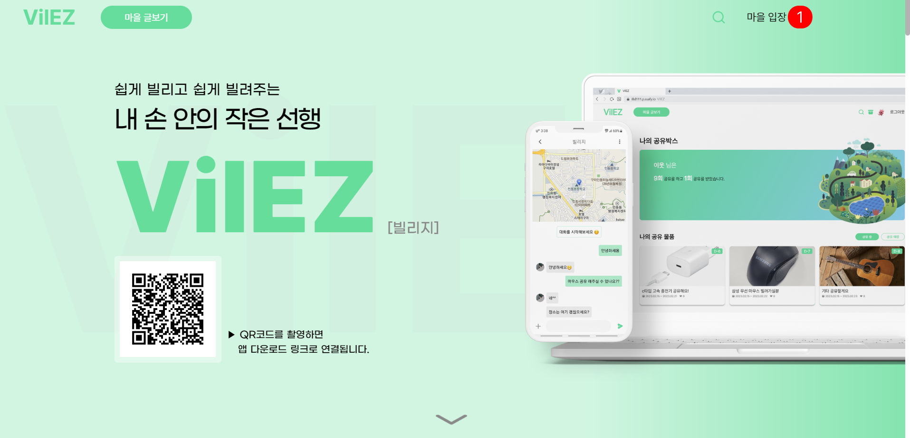

1. 빌리지 서비스를 이용하기 위해 로그인과 회원 가입을 할 수 있는 페이지로 이동하는 버튼

---

## 2. 로그인

### 2.1 로그인 화면

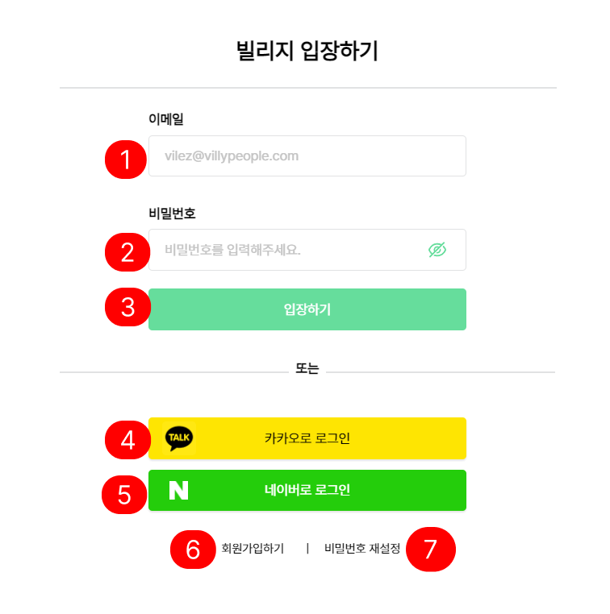

1. 일반 로그인을 할 때 입력하는 이메일 입력칸
2. 일반 로그인을 할 때 입력하는 비밀번호 입력칸
3. 일반 로그인을 할 때 입력한 이메일과 비밀번호로 로그인을 하는 버튼
4. 카카오 소셜 로그인으로 로그인을 하는 버튼
5. 네이버 소셜 로그인으로 로그인을 하는 버튼
6. 회원가입 페이지로 이동하는 버튼
7. 일반 로그인 유저에 대해 비밀번호를 재설정하는 페이지로 이동하는 버튼

### 2.2 비밀번호 재설정을 위한 이메일 인증 화면

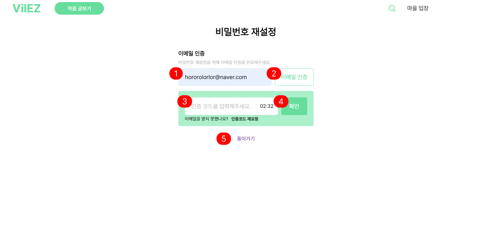

1. 비밀번호를 재설정하고 싶은 이메일 계정을 입력하는 칸
2. 이메일 인증 코드를 받기 위한 버튼
3. 인증 코드를 입력하는 칸
4. 인증 코드를 확인하는 버튼
5. 로그인 페이지로 돌아가는 버튼

### 2.3 비밀번호 재설정 화면

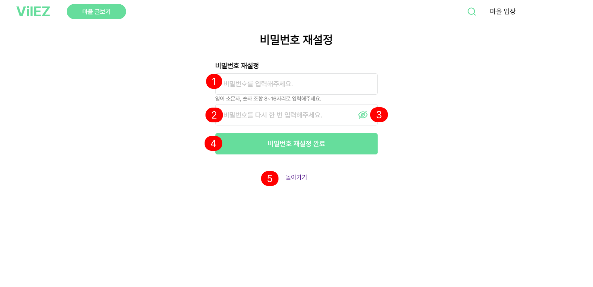

1. 재설정하고 싶은 비밀번호를 입력하는 칸
2. 재설정하고 싶은 비밀번호를 재확인하기 위해 다시 입력하는 칸
3. 기본적으로 가려져있는 비밀번호를 확인할 수 있는 버튼
4. 비밀번호 재설정을 완료하는 버튼
5. 로그인 페이지로 이동하는 버튼

---

## 3. 회원가입

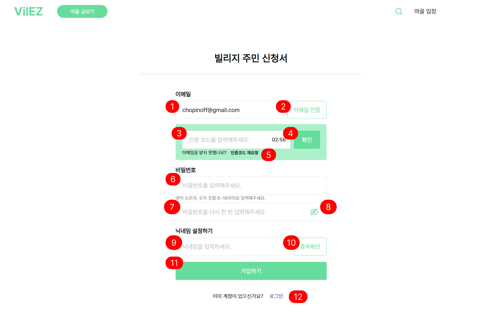

1. 일반 회원가입 시 사용자가 이메일을 입력하는 칸
2. 이메일 인증 코드를 받을 수 있는 버튼
3. 메일로 받은 인증 코드를 입력하는 칸
4. 인증 코드를 확인하는 버튼
5. 인증 코드를 재요청 받을 수 있는 버튼
6. 비밀번호를 입력하는 칸
7. 비밀번호 재확인을 위해 한 번 더 입력하는 칸
8. 기본적으로 가려져있는 비밀번호를 확인할 수 있는 버튼
9. 닉네임을 입력하는 칸
10. 닉네임 중복확인을 할 수 있는 버튼
11. 일반 회원가입을 하는 버튼
12. 이미 계정이 있을 경우 로그인 페이지로 이동하는 버튼

---

## 4. 마이페이지

### 4.1 공유 목록 화면

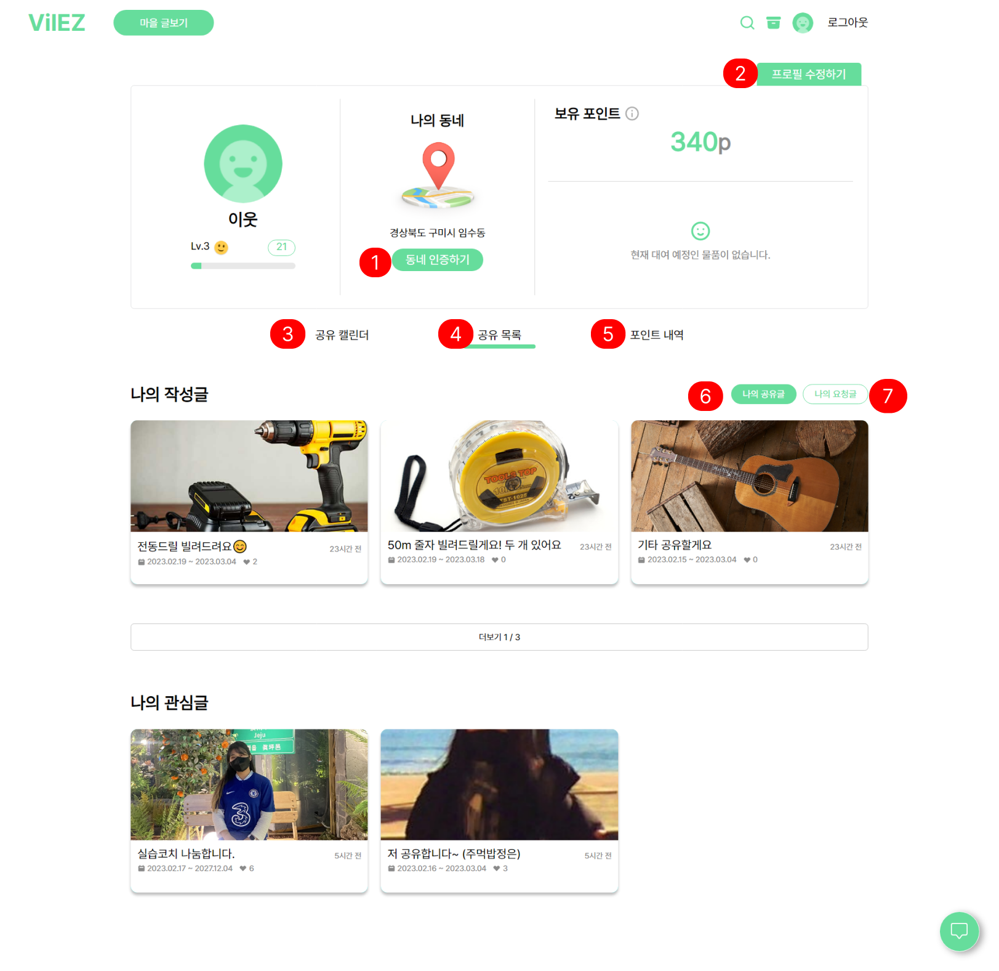

1. 사용자의 동네 인증을 하기 위한 QR코드를 열 수 있는 버튼
2. 사용자의 프로필을 수정할 수 있는 모달을 여는 버튼
3. 사용자가 지금까지의 확정됐던 모든 공유, 대여 내역들을 캘린더로 한 눈에 정리해서 보여주는 화면으로 이동하는 버튼
4. 사용자가 작성한 글과 사용자가 북마크 해놓은 글들을 모아보는 화면으로 이동하는 버튼
5. 사용자가 이때까지 추가되거나 차감된 포인트의 내역을 보여주는 화면으로 이동하는 버튼
6. 사용자가 작성한 글 중에서 공유글로써 올린 글들을 보여주는 토글 버튼
7. 사용자가 작성한 글 중에서 요청글로써 올린 글들을 보여주는 토글 버튼

### 4.2 공유 캘린더 화면

1. 공유가 약속된 내역은 초록색으로 표시
2. 대여가 약속된 내역은 파란색으로 표시

### 4.3 포인트 내역 화면

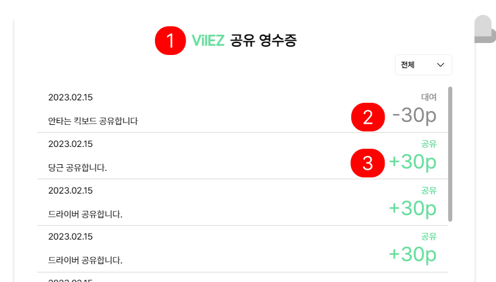

1. 사용자가 이때까지 추가되거나 차감된 포인트의 내역을 보여주는 화면
2. 사용자가 대여를 하면 30포인트가 차감
3. 사용자가 공유를 하면 30포인트가 추가

---

## 5. 모달

### 5.01 동네 인증 모달

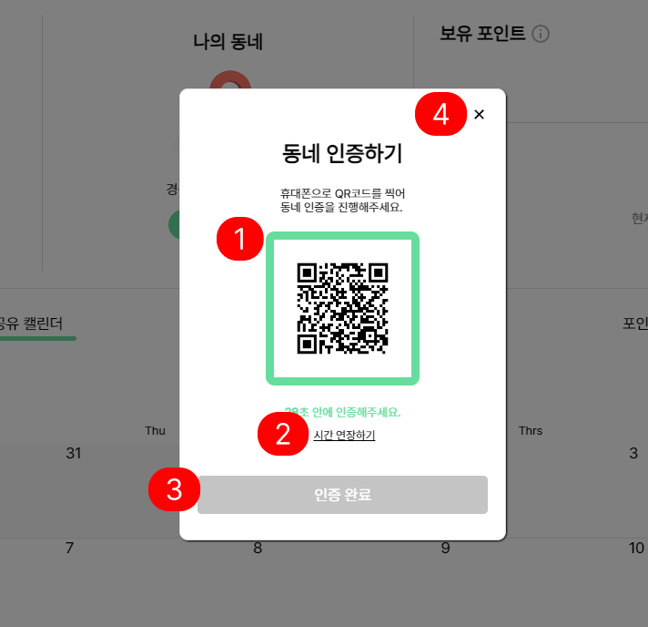

1. 사용자의 휴대폰으로 찍을 수 있는 QR코드
2. 시간 연장하기를 누르면 시간이 다시 30초로 갱신
3. 사용자가 인증 완료를 하기 전까지는 회색의 비활성화 버튼이 뜨고, 카메라로 QR코드를 찍어 동네 인증을 완료하면 초록색의 활성화 버튼이 뜸
4. 모달을 그냥 닫는 버튼

### 5.02 프로필 수정 모달

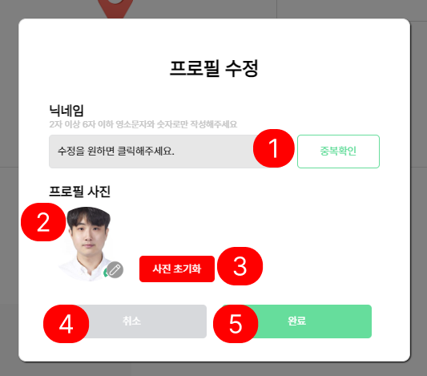

1. 닉네임을 변경할 수 있는 입력칸이다. 닉네임 변경을 원하지 않으면 그대로 두면 된다. 변경하고 싶은 닉네임을 입력하고나서는 오른쪽의 “중복 확인”버튼을 눌러 닉네임 중복확인을 반드시 거침
2. 현재 사용자의 프로필 사진을 보여줌
3. 사용자의 프로필 사진을 서비스 기본 프로필 사진으로 변경하는 버튼
4. 프로필 수정을 취소하고 모달을 닫는 버튼
5. 사용자가 원하는 변경사항들을 변경한 후에 완료 버튼을 누르면 정상적으로 프로필 수정이 이루어지는 버튼

### 5.03 희망 공유 기간 설정 모달

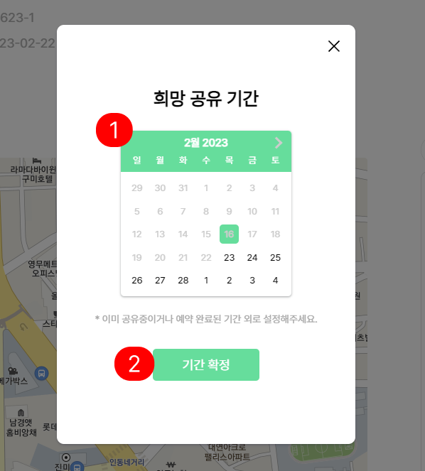

1. 공유자와 피공유자가 합의한 후에 결정된 공유 기간을 설정한다. 이미 해당 물품에 대해 공유가 진행중이라면 진행되고 있는 공유기간은 달력에서 제외돼서 표시
2. 기간 확정을 누르는 버튼

### 5.04 서약서 작성 모달

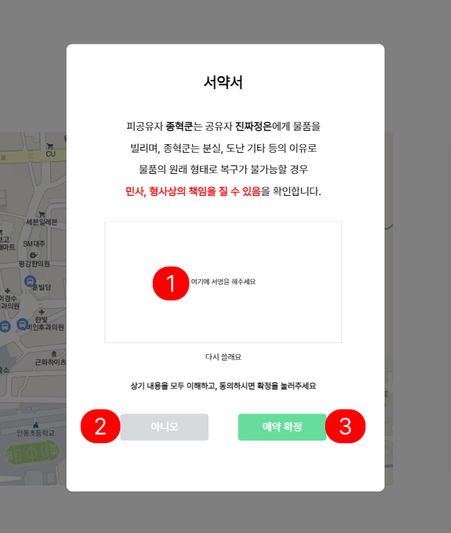

1. 피공유자가 마우스 좌클릭으로 서명을 함
2. 모달을 닫는 버튼
3. 서명을 마친 후에 예약 확정을 누르는 버튼

### 5.05 서약서 확인 모달

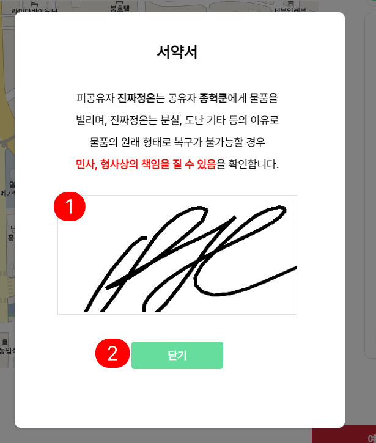

1. 피공유자가 작성한 서명
2. 모달을 닫는 버튼

### 5.06 공유 확인 모달

1.  최종 공유 확인에서 돌아갈 수 있는 버튼
2.  최종 공유 확인에서 공유가 시작되는 버튼

### 5.07 공유 확인 모달

1. 예약 확정 모달을 닫을 수 있는 버튼

### 5.08 상대 평가 모달

1. 매너점수를 별표시로 할 수 있는 효과
2. 모달을 닫을 수 있는 버튼
3. 반납을 확정하는 모달

### 5.09 공유 종료 모달

1. 공유 종료 모달을 닫을 수 있는 버튼

### 5.10 예약 취소 요청 모달

1. 모달을 닫을 수 있는 버튼
2. 예약 취소 요청을 전송하는 버튼

### 5.11 채팅 종료 확정 모달

1. 채팅 종료 확인 모달을 끌 수 있는 버튼
2. 채팅을 완전히 종료하는 버튼

### 5.12 예약 취소 확정 모달

1. 예약 취소 확정 모달 닫는 버튼
2. 예약 취소 확정 하는 버튼

### 5.13 글 삭제 확인 모달

1. 글 삭제 확인 모달을 닫을 수 있는 버튼
2. 글 삭제를 확정하는 버튼

### 5.14 비소셜계정 프로필 수정 모달

1. 닉네임을 수정할 수 있는 입력 칸
2. 닉네임이 현재 있는 유저의 닉네임과 일치하는 것이 있는지 확인하는 버튼
3. 비밀번호를 수정할 수 있는 입력 칸
4. 비밀번호 재입력 하는 칸
5. 현재 프로필 사진을 보여주고 프로필 사진을 수정할 수 있는 버튼
6. 사진을 초기화 할 수 있는 버튼
7. 프로필 수정모달에서 돌아갈 수 있는 버튼
8. 수정된 프로필을 완료하는 버튼

---

## 6. 마이 박스 페이지

1. 공유 중인 것만 볼 수 있는 필터 버튼
2. 공유 예정인 것만 볼 수 있는 필터 버튼
3. 대여 중인 물품만 볼 수 있는 필터 버튼
4. 대여 예정인 물품만 볼 수 있는 필터 버튼

---

## 7. 물품 공유 / 요청

### 7.1 물품 등록

1. 공유 / 공유 요청 선택 필터
2. 제목 입력하는 칸
3. 카테고리 고르는 필터
4. 설명 내용을 적는 칸
5. 물품에 대한 사진을 첨부할 수 있는 버튼
6. 첨부된 사진 목록이 보이는 칸
7. 희망 공유 기간을 정할 수 있는 캘린더가 나오는 칸
8. 초록색 영역 안에서 마우스 우클릭으로 장소를 정할 수 있는 지도

### 7.2 물품 리스트

1. 공유 / 요청 목록을 보여주는 텍스트
2. 카테고리별로 분류하여 볼 수 있는 필터
3. 물품 등록 페이지로 갈 수 있는 버튼
4. 찾고 싶은 물품을 검색하는 칸
5. 공유되지 않은 상태의 물품만 볼 수 있게 하는 버튼
6. 클릭하면 물품의 상세 보기로 갈 수 있는 카드뷰

### 7.3 물품 상세보기

1. 북마크를 할 수 있는 버튼. 버튼 클릭시 색상이 변함
2. 글을 올린 사용자가 채팅을 시작할 수 있는 버튼
3. 해당 글의 설명에 대한 칸
4. 희망 공유 기간에 정보 칸
5. 글을 올린 사용자가 희망하는 공유장소 지도 정보
6. 해당 게시물을 공유할 수 있는 버튼
7. 맨 위로 이동할 수 있는 버튼
8. 해당 글이 있던 목록으로 이동할 수 있는 버튼

---

## 8. 채팅 및 공유지도

### 8.1 예약 전 - 공유자 입장

1. 피공유자와 대화를 나눈 후 확정된 공유 기간을 정하는 모달을 띄우는 버튼으로 예약 전에는 공유자만 설정할 수 있고, 예약 후에는 피공유자에게도 설정된 기간의 모달을 띄어줌
2. 피공유자가 서명한 서약서를 볼 수 있는 모달을 띄우는 버튼으로 예약이 확정된 후부터 확인이 가능
3. 피공유자와 함께보는 실시간 공유 지도
4. 피공유자에게 채팅을 할 수 있는 입력 칸
5. 예약 전이므로 언제든지 채팅을 종료할 수 있는 버튼

### 8.2 예약 전 - 피공유자 입장

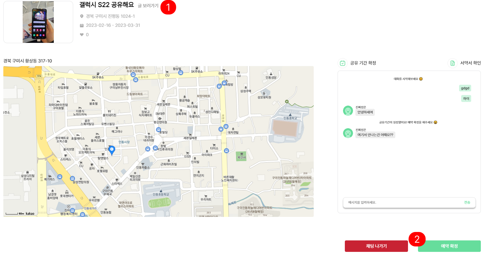

1. 공유자가 올린 게시글의 상세보기 페이지로 이동하는 버튼
2. 공유자가 공유 기간을 확정한 후에, 피공유자가 예약을 확정할 때 누르는 버튼

### 8.3 예약 중 - 공유자 입장

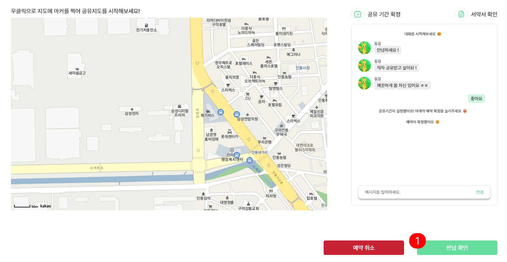

1. 공유자가 피공유자로부터 물품을 제대로 반납받은 후에 누르는 버튼

### 8.4 예약 중 - 피공유자 입장

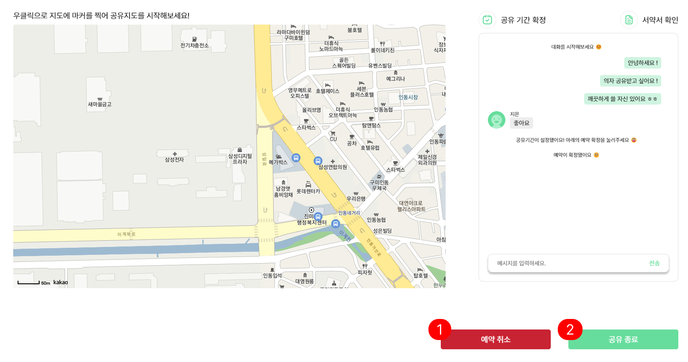

1. 예약이 확정된 후 예약을 취소하는 모달을 띄우는 버튼
2. 공유자가 물건에 대한 반납 확인을 마친 후에 누르는 버튼으로 피공유자가 최종적으로 공유를 끝맺을 수 있음

### 8.5 공유 종료 후 / 예약 취소 후

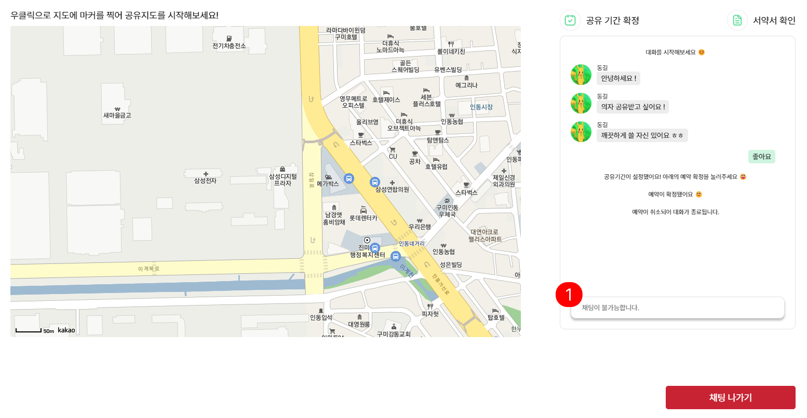

1. 공유 종료나 예약이 취소된 후에는 더 이상 채팅이나 실시간 공유지도 기능을 사용하지 못하며 채팅방을 나가기 전까지는 채팅방이 남아있게 됨
